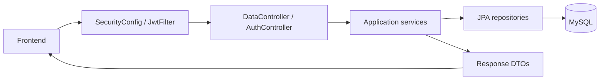
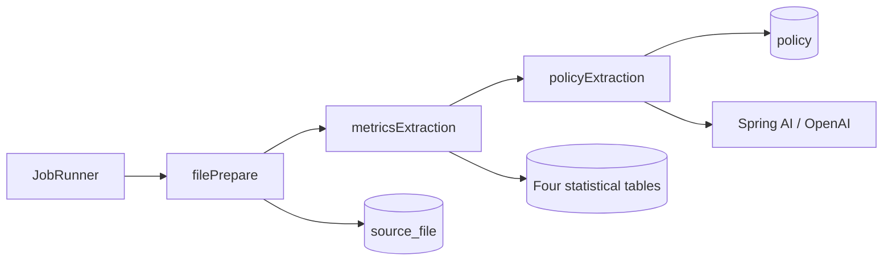

# Backend Architecture

The backend is a Spring Boot modular monolith using Java and MySQL. It provides
REST APIs for the frontend and a separately launched ingestion workflow within
the same application. Flyway manages the database schema.

## Package Responsibilities

All application packages are under `com.hazely.laborlens`.

| Package | Responsibility |
| --- | --- |
| `controllers/` | `DataController` for data queries; `AuthController` for account operations |
| `services/` | Statistical queries, policy queries, metadata, filter validation and account logic |
| `repositories/` | Spring Data JPA access to statistics, policies, sources, runs and users |
| `entities/` | Database mappings and shared metric contracts |
| `entities/enums/` | Stable category codes and English display labels |
| `dtos/` | Request and response contracts in `DataDtos` and `AuthDtos` |
| `config/` | Stateless security configuration and credentialed CORS |
| `security/` | JWT filter, token signing/validation and refresh-cookie handling |
| `exceptions/` | Query/authentication errors and response handlers |
| `jobs/` | Manual ingestion runner and shared file, lock, transaction and run-history infrastructure |

`src/main/resources` contains application profiles and Flyway migrations.
Policy prompt and output-format JSON files live under
`jobs/policyExtraction/promts/` and are included in the application resources.

## API Request Flow

- `MetricService` validates filters through `DataFilters`, queries the selected
  statistical repository and creates trend or comparison responses. Missing
  observations become `null` period/category slots.
- `DataCatalog` supplies fixed dataset-specific metadata and enum labels without
  querying stored values for option availability.
- `PolicyService` returns policies and source links. `PolicyEvidence` reads optional
  page citations from the latest successful extraction artifacts.
- `AuthService` handles accounts, password hashes and token-version revocation.
  JWT authentication checks both token validity and the current user record.
- Access tokens use bearer headers. Refresh and logout use an HttpOnly cookie
  with an explicit origin check. Tokens are not persisted in MySQL.

## Ingestion Flow

The `ingestion` profile starts a non-web process and enables `JobRunner`.
Normal application startup serves APIs without running ingestion jobs.

1. `FileJob` prepares all four CSVs and five PDFs and registers their checksums.
2. `CsvJob` parses, validates and imports each statistical file in order.
3. `PdfJob` uses `PolicyAi` to send each complete PDF with the prompt and output
   rules, validates the response, then stores policies and evidence artifacts.

Jobs use `JobStore` with direct JDBC, explicit transactions and MySQL locks;
they do not write through the API's JPA repositories. `JobFiles` manages source
files and immutable run artifacts. A failed job stops the pipeline while earlier
committed results remain intact. Matching successful inputs can be skipped.

## Storage Boundaries

- **MySQL:** four statistical tables, `policy`, `source_file`, `job_run` and `users`.
- **Data directory:** original CSV/PDF files and per-run inputs, AI responses and evidence.
- **Flyway:** V1 creates the data and ingestion schema; V2 adds user accounts.
- **Configuration:** database, AI and authentication settings are supplied separately
  from application code.

See [Backend Data API](backend_api.md), [Authentication](authentication.md),
[Data Ingestion](data_ingestion.md) and [Schema Design](schema_design.md).
Startup commands are in the [Backend README](../backend/README.md).
