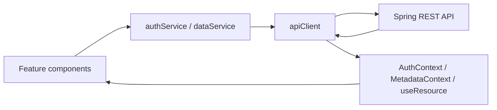

# Frontend Architecture

The frontend uses Next.js App Router, React and TypeScript. Routes and layouts
compose browser-side features; the browser calls the Spring backend directly.
There is no Next.js API proxy or server-side token store.

## Directory Responsibilities

| Directory | Responsibility |
| --- | --- |
| `app/` | Routes, layouts, global styles and theme setup |
| `contexts/` | Authentication state and metadata shared across data pages |
| `hooks/` | Access to authentication context and cancellable data loading |
| `components/` | Shared header, application shell, modal and request states |
| `features/home/` | Public homepage |
| `features/auth/` | Account dialogs and protected-content gate |
| `features/statistics/` | Trend filters, SVG line charts and HTML/CSS comparisons |
| `features/policies/` | Category selection, policy timeline and source links |
| `services/` | API client and authentication/data request functions |
| `utils/` | API types, routes, chart helpers and colour palette |

## Component Structure

```text
RootLayout
└── AppShell
    └── AuthProvider
        ├── Header
        ├── Session messages
        ├── Route content
        │   ├── / → Home
        │   └── /[dataset] → RequireAuth
        │       └── MetadataProvider
        │           └── DataPage
        │               ├── StatisticsPage → TrendView + ComparisonView
        │               └── PoliciesPage
        └── AuthDialog → Modal
```

Monthly unemployment renders only `TrendView`. Other statistical pages show
trend and comparison together, with left section navigation and right series
filters. `MetadataProvider` is mounted only after authentication and supplies
labels, options, defaults and periods to all five data pages.

## Page Navigation

```text
Home (/)
├── Sign up dialog → Log in dialog
└── Log in → Annual employment

Authenticated header
├── Logo → Home (/)
├── Annual employment → /annual-employment-rate
├── Monthly unemployment → /monthly-unemployment-rate
├── Quarterly employment → /quarterly-employment-rate
├── Employment count → /quarterly-employment-count
├── Policies → /policies
└── Account menu
    ├── Change username → dialog
    ├── Change password → dialog → Log in
    ├── Log out → Home
    └── Delete account → confirmation/password dialog → Home
```

The five data URLs share `app/[dataset]/layout.tsx` and `page.tsx`; supported
route names and titles are defined in `utils/pages.ts`. Unknown dataset names
resolve to not found. Signed-out data routes show a login prompt without loading
data. Account dialogs and policy category tabs do not create separate routes.
Trend/comparison navigation uses `#trend` and `#comparison` anchors on the same page.

## State and Data Flow



- `apiClient` owns the in-memory access token and session subscriptions.
  `AuthProvider` restores the session using the refresh cookie and exposes it to React.
- Requests authenticate by default. Public authentication calls use `auth: false`.
  Cookies are included; simultaneous refreshes share one request, and a protected
  request retries at most once after a 401.
- `useResource` handles loading, errors, retry and cancellation of obsolete requests.
- Filter cards, comparison periods and policy categories use local feature state.
  API responses retain missing values as `null`.
- The shared API client is browser-only. Backend authentication remains the
  authority for access control, independently of `RequireAuth`.

See [Frontend Design](frontend_design.md) for presentation rules and
[Frontend README](../frontend/README.md) for configuration and startup.
